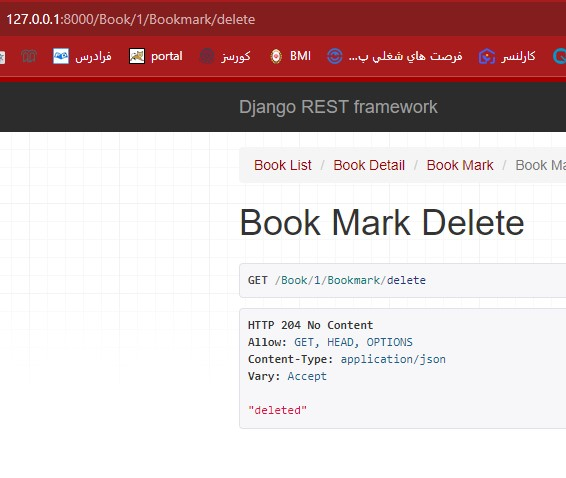

# GoodReads
 BimeBazar Backend Task

# Installations
1. asgiref==3.8.1
2. Django==5.0.4
3. djangorestframework==3.15.1
4. sqlparse==0.5.0
5. tzdata==2024.1

# API's

#### book Api's
    1)
        https://-----/Book/
this Api while return a list of Books.

    
    
    2) 
        https://-----/Book/book id/
this Api while return details of book with <book id> id number.

    3)
        https://-----/Book/book id/Bookmark
You must be authenticated to use this API.

this Api while append book with id number <book id> in to your bookmark shelf.

The picture below is the successful API request.

 
##### You will have problems when you have any of the following:
1.You have rated the desired book or left a comment for it.
    
2.Have this book on your bookmark shelf.

    4)
        https://-----/Book/book id/Bookmark/delete

You must be authenticated to use this API.

this Api while delete book with id number <book id> from your bookmark shelf.

